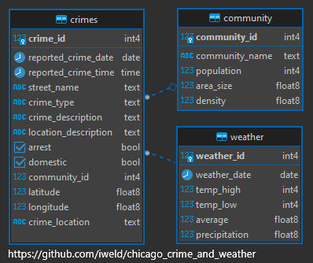

# Chicago Crime and Weather

**Author**: Dileep Svns  
**Email**: dileepsingidi45@gmail.com  
**LinkedIn**: [linkedin.com/in/Dileep](https://linkedin.com/in/Dileep)  

:exclamation: If you find this repository helpful, please consider giving it a :star:. Thanks! :exclamation:

## Introduction
An SQL analysis of reported crimes in the city of Chicago and the average daily temperature between 2018 and 2023.

* [Data Analysis Question & Answers](./questions_and_answers.md)

## Datasets used
Eight key [datasets](./source_data/csv/) for this case study:
- **chicago_areas.csv**: Chicago neighborhoods and areas.
- **chicago_temps_18-23.csv**: City Weather 2018-2022.
- **chicago_crime_2018.csv**: Reported crimes in 2018.
- **chicago_crime_2019.csv**: Reported crimes in 2019.
- **chicago_crime_2020.csv**: Reported crimes in 2020.
- **chicago_crime_2021.csv**: Reported crimes in 2021.
- **chicago_crime_2022.csv**: Reported crimes in 2022.
- **chicago_crime_2023.csv**: Reported crimes in 2023.

## Entity Relationship Diagram

:exclamation: If you find this repository helpful, please consider giving it a :star:. Thanks! :exclamation:

## About Me
### Education
- **National Institute of Technology, Srinagar, Jammu and Kashmir**  
  *Bachelor of Technology in Electronics and Communication Engineering (Aug 2021 – Jun 2025)*
- **Sasi Junior College, Velivennu, Andhra Pradesh**  
  *Intermediate*
- **Sri Chaitanya High School, Tadepalligudem, Andhra Pradesh**  
  *10th Standard*

### Experience
- **Research Intern, National Institute of Technology, Warangal** (Dec 2023 – Jan 2024, Telangana)
  - Gained knowledge of image fusion techniques.
  - Developed strong analytical and problem-solving skills through various research activities and discussions.
  - Developed and implemented Python scripts for image preprocessing, fusion, and analysis.

### Projects
- **Medical Diagnostic Image Fusion Based on SOFMNN | Python, Pandas**
  - Introduced a novel fusion technique using wavelet transforms and neural networks for medical imaging.
  - Effectively integrates MRI and SPECT data, preserving structural and functional details.
  - Enhances the accuracy of detecting pathological areas for better clinical diagnosis.
- **Voice Selfie App**
  - **Domain**: Web Application — **Programming Languages**: JavaScript
  - Built an application that detects the user's voice and takes a selfie on command.
  - Used JavaScript libraries to access the mic and camera of the system.
  - Designed an interactive UI using HTML, CSS3, and JavaScript.

### Technical Skills
- **Languages**: JavaScript, Python, C++, HTML, CSS, SQL
- **Developer Tools**: Git, Visual Studio Code, PyCharm
- **Core**: Analog and Digital Electronics, Communication Systems

### Co-Curricular Activities
- Most Valuable Player in the school Volleyball tournament (2017-18)

